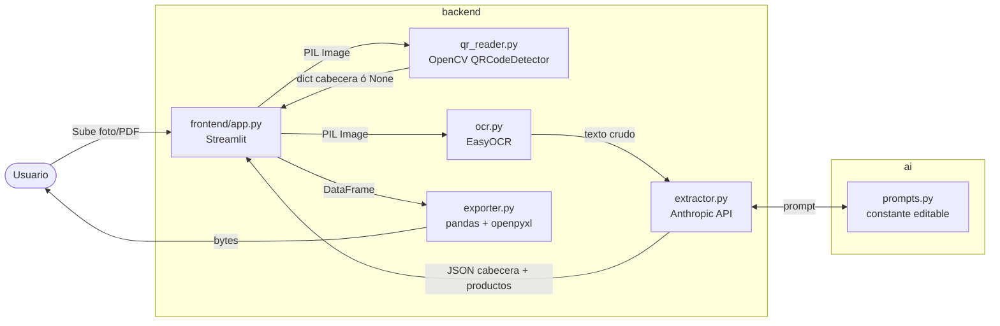

# ⚡ FacturaFlash

> **Digitaliza las facturas de compra de tu bodega en segundos** — sube una foto, la app lee el QR SUNAT, extrae los productos con OCR + IA y te entrega una tabla editable lista para exportar a Excel.

---

## Cómo correr en local

```bash
# 1. Clona el repo y entra al directorio
git clone <repo-url>
cd facturaflash

# 2. Crea el entorno virtual con Python 3.12
#    (PyTorch/EasyOCR no soportan Python 3.13 aún)
python3.12 -m venv .venv312
source .venv312/bin/activate   # Windows: .venv312\Scripts\activate

# 3. Instala PyTorch CPU (paso separado — requiere su propio índice)
pip install torch torchvision --index-url https://download.pytorch.org/whl/cpu

# 4. Instala el resto de dependencias
pip install -r requirements.txt

# 5. Configura tu API key de Anthropic
cp .env.example .env
# Edita .env y reemplaza "tu_key_aqui" con tu clave real

# 6. Lanza la app
streamlit run frontend/app.py
```

La app abre en `http://localhost:8501`.  
**No tienes API key aún?** Activa el toggle **Modo Demo** en la barra lateral — funciona sin imagen ni clave.

> **Nota:** La primera ejecución descarga los modelos de EasyOCR (~100 MB). Las siguientes son rápidas porque el modelo queda cacheado en `~/.EasyOCR/`.

### Dependencias de sistema (Linux / Streamlit Cloud)

`packages.txt` ya las declara para Streamlit Cloud. En Ubuntu/Debian local:

```bash
sudo apt-get install -y libzbar0 libgomp1
```

---

## Arquitectura



### Flujo de datos

| Paso | Módulo | Entrada | Salida |
|------|--------|---------|--------|
| 1 | `qr_reader.py` | Imagen PIL | Dict `{ruc, serie, fecha, total}` ó `None` si no hay QR |
| 2 | `ocr.py` | Imagen PIL | Texto plano (líneas de la factura) |
| 3 | `extractor.py` | Texto OCR + datos QR | JSON `{cabecera: {...}, productos: [...]}` |
| 4 | `exporter.py` | DataFrame editado | Bytes `.xlsx` / string CSV |

### Lógica de fusión QR + OCR

```
Si QR detectado:
    cabecera ← datos del QR (exactos: RUC, serie, total, fecha)
    productos ← Claude extrae del texto OCR
Si NO hay QR:
    cabecera + productos ← Claude infiere todo del texto OCR
```

---

## Estructura de carpetas

```
facturaflash/
├── frontend/
│   └── app.py              ← app Streamlit (orquesta UI + backend)
├── backend/
│   ├── qr_reader.py        ← lectura QR SUNAT (OpenCV multi-estrategia)
│   ├── ocr.py              ← extracción de texto (EasyOCR español)
│   ├── extractor.py        ← llamada a Claude, parseo JSON
│   └── exporter.py         ← export a .xlsx y .csv
├── ai/
│   └── prompts.py          ← prompt de extracción (editable)
├── data/
│   └── samples/            ← pon aquí tus fotos de facturas de prueba
├── notebooks/
│   └── exploracion.ipynb   ← prueba cada módulo por separado
├── requirements.txt
├── packages.txt            ← dependencias del sistema para Streamlit Cloud
└── .env.example
```

---

## Herramientas del curso usadas

| Herramienta | Propósito | Archivo |
|-------------|-----------|---------|
| **EasyOCR** | Reconocimiento óptico de caracteres en español sobre la imagen de la factura | `backend/ocr.py` |
| **API de Claude (Anthropic)** | Interpretar el texto OCR y estructurarlo como JSON de cabecera + productos | `backend/extractor.py`, `ai/prompts.py` |

### Otros componentes clave

| Componente | Propósito | Archivo |
|------------|-----------|---------|
| `OpenCV QRCodeDetector` | Decodificación del QR SUNAT con múltiples estrategias de preprocesamiento | `backend/qr_reader.py` |
| `Streamlit` | Interfaz web completa (upload, tabla editable, descarga) | `frontend/app.py` |
| `pandas` + `openpyxl` | Exportación a Excel y CSV | `backend/exporter.py` |

---

## Despliegue en Streamlit Community Cloud

1. Sube el repo a GitHub (sin `.env`).
2. En Streamlit Cloud → **New app** → apunta a `frontend/app.py`.
3. En **Secrets**, agrega:
   ```toml
   ANTHROPIC_API_KEY = "sk-ant-..."
   ```
4. `packages.txt` se procesa automáticamente.

> **Importante:** Streamlit Cloud corre en Ubuntu con Python 3.12. El paso de PyTorch se
> maneja vía `requirements.txt` — el índice CPU se configura con una línea
> `--extra-index-url` o separando la instalación en el `packages.txt`.

---

## Autor

Proyecto MVP — FacturaFlash  
Licencia MIT
